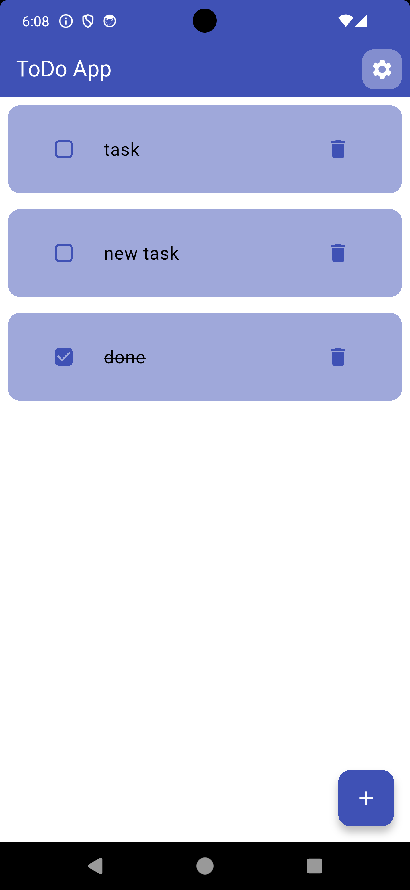
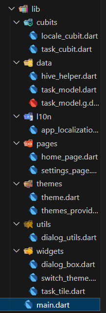
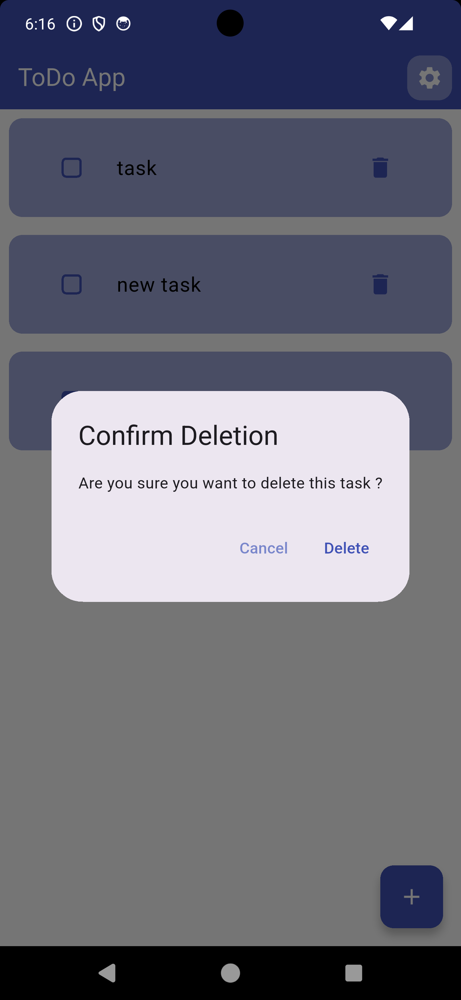
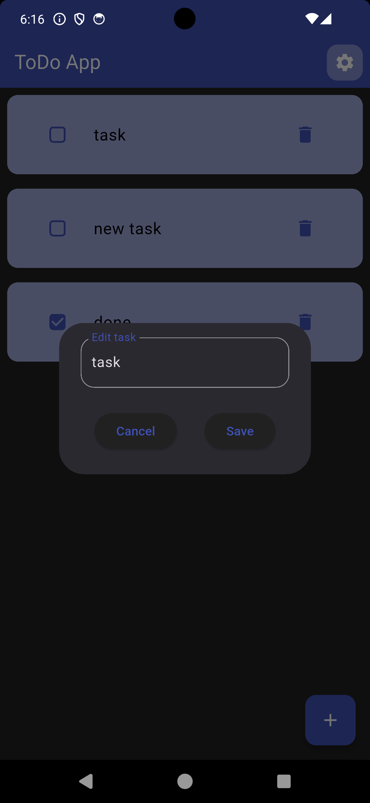

# 📝 ToDo App | Flutter Task Manager



A simple and elegant **ToDo App** built with **Flutter** and **Hive** for local storage.  
This app supports **dark mode**, **multi-language localization (English & Arabic)**, and **state management using BLoC**.

---

## 🚀 Features

✅ **Add, edit, and delete tasks**  
✅ **Mark tasks as completed**  
✅ **Persistent storage using Hive**  
✅ **Dark Mode support 🌙**  
✅ **Multi-language support (English & Arabic) 🌍**  
✅ **State management with BLoC (Cubit)**  
✅ **Modern UI with smooth animations**  

---

## 📌 Tech Stack

- **Flutter** 🏗️ (Framework)
- **Hive** 🗂️ (Local Database)
- **BLoC (Cubit)** 🎛️ (State Management)
- **Provider** 🔄 (Theme & Locale Management)
- **Flutter Localization** 🌍 (Multi-language support)

---

## 📂 Folder Structure

Below is the folder structure of this project, which follows **Clean Architecture** principles.  



This project is well-organized into multiple layers:  
- **Data Layer** (Handles local storage with Hive)  
- **Business Logic Layer** (Manages state using BLoC Cubits)  
- **Presentation Layer** (UI & Widgets)  

---

## 🎬 Screenshots

<p align="center">
  <b>Light Mode</b> &nbsp;&nbsp;&nbsp;&nbsp;&nbsp;&nbsp;&nbsp;&nbsp; <b>Dark Mode</b><br>
  
  &nbsp;&nbsp;&nbsp;&nbsp;
  
</p>

---

## 🔧 Installation & Run

```bash
git clone https://github.com/rababhamdyy/todo_app.git
cd todo_app
flutter pub get
flutter run
